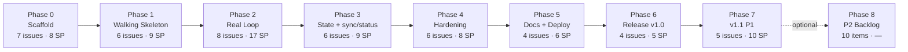
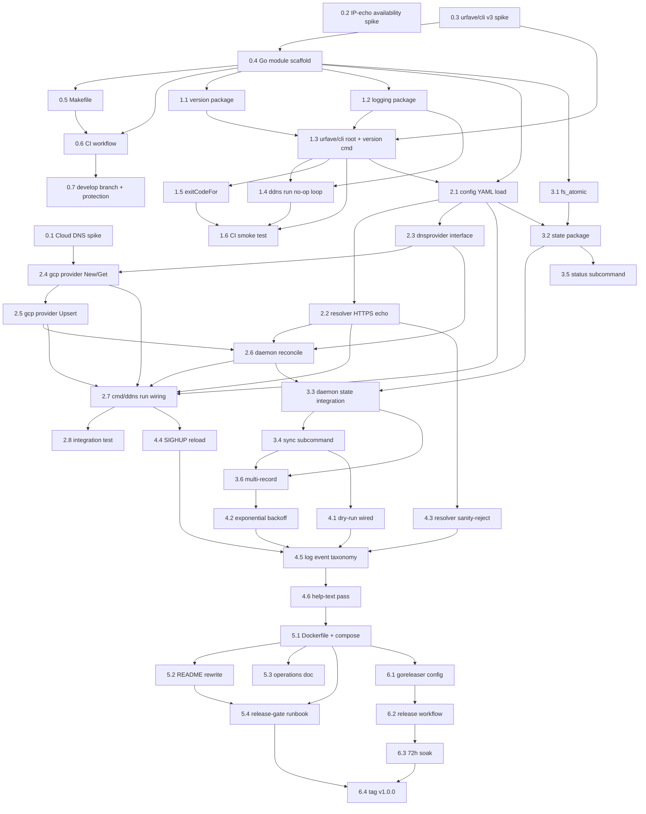

**Connections:**
- [[prd]]
- [[project-plan]]
- [[architecture]]

# Issue Estimates: `ddns`

Sprint-ready issue breakdown for the eight-phase (walking-skeleton-first) project plan. Each phase file is a self-contained, code-writer-ready document; this README is the index and the audit trail.

## Estimation Approach

- **Scale:** 1 / 2 / 3 (story points).
- **Target:** every issue is 1–2 days of focused work. A 3-point issue is the upper bound; any larger idea is split.
- **Scope:** points include coding, testing, review, and integration time — not just the coding step.
- **Execution model:** single-stream, single code-writer by default (project-plan §Default Execution Model). No parallelism is extracted.

## Totals

| | Count | Story points |
|---|---|---|
| **Total issues (phases 0–6)** | **41** | **62** |
| Phase 7 issues (P1) | 5 | 10 |
| Phase 8 backlog items | 10 | — (no estimate) |

## Phase Rollup

| Phase | File | Issue count | Total SP | Shippable milestone |
|---|---|---|---|---|
| 0 | [phase-0-scaffold.md](phase-0-scaffold.md) | 7 | 8 | Module + CI, no binary behavior |
| 1 | [phase-1-skeleton.md](phase-1-skeleton.md) | 6 | 9 | **Walking-skeleton binary** — `ddns version` + no-op `ddns run` |
| 2 | [phase-2-real-loop.md](phase-2-real-loop.md) | 8 | 17 | First real Cloud DNS update |
| 3 | [phase-3-state-sync-status.md](phase-3-state-sync-status.md) | 6 | 9 | `sync` + `status` + state persistence |
| 4 | [phase-4-hardening.md](phase-4-hardening.md) | 6 | 8 | Dry-run, backoff, SIGHUP, sanity |
| 5 | [phase-5-docs-deploy.md](phase-5-docs-deploy.md) | 4 | 6 | Docker / README / ops / runbook |
| 6 | [phase-6-release.md](phase-6-release.md) | 4 | 5 | **v1.0.0 tagged** |
| 7 | [phase-7-v1.1.md](phase-7-v1.1.md) | 5 | 10 | v1.1 (P1 items) |
| 8 | [phase-8-p2.md](phase-8-p2.md) | 10 | — | P2 backlog, not committed |
| **Total (0–6)** | | **41** | **62** | |

At ~1.5 issues/day sustained (single senior code-writer with full test coverage), phases 0–6 are roughly 25–30 working days end-to-end.

## Walking-Skeleton Invariant

Every phase after Phase 1 must preserve the property that `go install github.com/rootwarp/ddns/cmd/ddns@develop` produces a non-panicking binary. This is enforced by the CI smoke test added in issue 1.6 and run on every PR. A PR that breaks the smoke test cannot merge — the invariant is what keeps the walking-skeleton discipline from eroding.

## Shippable-Binary Milestones

| After phase | `./bin/ddns` can do |
|---|---|
| 0 | Link and print nothing |
| 1 | `ddns version`, `ddns --help`, `ddns run` (no-op loop) |
| 2 | `ddns run` updates a real Cloud DNS `A` record end-to-end |
| 3 | `ddns sync`, `ddns status`; state survives restart; multi-record |
| 4 | `--dry-run`, exponential backoff, SIGHUP config reload, strict resolver sanity |
| 5 | Above + Docker deployment shape and docs |
| 6 | Above + tagged, cross-compiled, signed-archive release |

## Phase Dependency Graph

### Issue-Level Dependency Graph

## PRD Requirement → Issue Coverage Matrix

Every P0 PRD requirement maps to at least one issue. P1 items go to Phase 7; P2 to Phase 8.

### P0 (must ship in v1)

| PRD requirement | Primary issue(s) | Supporting |
|---|---|---|
| YAML config load + validation | 2.1 | 4.4 (SIGHUP reload) |
| Google Cloud DNS client (ADC, `Get`) | 2.4 | 0.1 (spike) |
| Google Cloud DNS `Upsert` | 2.5 | 0.1, 2.8 (integration) |
| Public IP resolution (HTTPS echo + quorum) | 2.2 | 0.2 (availability spike), 4.3 (sanity) |
| State persistence (atomic write) | 3.1, 3.2 | 3.3 (integration) |
| Change detection (state + live double-check) | 3.3 | 2.6 (single-record precursor) |
| Daemon loop (`ddns run`) | 1.4 (no-op), 2.7 (real) | 4.2 (backoff), 4.4 (SIGHUP) |
| One-shot mode (`ddns sync`) | 3.4 | 4.1 (--dry-run) |
| Status command (`ddns status`) | 3.5 | — |
| Version command (`ddns version`) | 1.1 (metadata), 1.3 (cmd) | — |
| `--dry-run` flag | 4.1 | 3.4 (flag surface) |
| Structured logging (slog text/json/auto) | 1.2 | 4.5 (taxonomy), 3.3 (event attrs) |
| Signal handling (SIGINT/SIGTERM) | 1.4 (skeleton), 2.7 (real) | 4.4 (SIGHUP) |
| Docker image | 5.1 | 6.1 (release-time multi-arch) |
| Exit-code discipline | 1.5 (mapping), 3.4 (sync codes) | — |

### P1 (v1.1 — Phase 7)

| PRD requirement | Primary issue(s) |
|---|---|
| Post-update webhook | 7.1 |
| Health endpoint (`/healthz`, `/readyz`, `/state`) | 7.2 |
| Prometheus metrics | 7.3 |
| Second provider (Cloudflare) | 7.4 |

### P2 (Phase 8 backlog, not committed)

| PRD item | Backlog location |
|---|---|
| Route 53 provider | 8.1 |
| RFC 2136 / nsupdate provider | 8.2 |
| Router-side IP detection (UPnP/NAT-PMP) | 8.3 |
| Container image signing | 8.4 |
| Windows support | 8.5 |
| Other items | 8.6–8.10 |

## Architecture Module → Issue Coverage

Every architecture-doc module has at least one implementing or extending issue.

| Module | Implementing issue(s) |
|---|---|
| `cmd/ddns` | 1.3, 1.4, 1.5, 2.7, 3.4, 3.5, 4.1, 4.4, 4.6 |
| `internal/config` | 2.1, 4.4 (path-tracking for reload) |
| `internal/resolver` | 2.2, 4.3 (sanity-reject) |
| `internal/dnsprovider` | 2.3 |
| `internal/dnsprovider/gcp` | 2.4, 2.5 |
| `internal/state` | 3.2 |
| `internal/daemon` | 2.6, 3.3, 3.6, 4.1, 4.2, 4.4 (UpdateConfig) |
| `internal/logging` | 1.2, 4.5 (event taxonomy) |
| `internal/fs_atomic` | 3.1 |
| `internal/version` | 1.1 |
| `internal/health` | 7.2 (v1.1) |

## Design Calls for Sanity Check

Three decisions made during decomposition that are grounded in the PRD and architecture docs but may warrant explicit user sign-off before Phase 2 begins:

1. **Single-record in Phase 2, multi-record in Phase 3.** Issue 2.6 deliberately hard-codes `cfg.Records[0]`; issue 3.6 generalizes. This keeps the Phase 2 integration test honest (one resource to create, update, delete) at the cost of an extra small issue in Phase 3. If the user prefers multi-record from Phase 2, collapse 3.6 into 2.6 and add +1 SP to 2.6.

2. **State-file directory as `~/.local/state/ddns/state/`** (note the double `state/`). The inner `state/` holds per-record JSON files; this leaves room under `~/.local/state/ddns/` for future files (logs, lockfile, cache) without mixing concerns. Alternative: flatten to `~/.local/state/ddns/<hash>.json`. The current choice is documented in architecture §2 issue 3.2; revisit if the user finds the double-state ugly.

3. **Separate error package `internal/ddnserr` vs embedding sentinels in the daemon or in each caller.** The decomposition chose a separate package to avoid import cycles (every other package imports `ddnserr`, nothing imports them). Renaming it away from `ddnserr` is fine — `errs`, `apperr`, `daemonerr` are all acceptable — but the separate-package structure is load-bearing.

## Items the User Should Confirm

None block Phase 0, but each is a decision worth being explicit about before Phase 5:

- **Docker base image.** Issue 5.1 uses `gcr.io/distroless/static-debian12:nonroot`. Alternatives: Alpine (smaller but includes a shell + musl), scratch (smallest but no CA bundle — would break HTTPS calls). Distroless is the safe default.
- **No host-service unit files.** v1 explicitly does not ship systemd units or launchd plists. Operators wanting OS-level supervision wrap the container with their own init. Revisit only if a user specifically asks for one.
- **Release publication registry.** Issue 6.1 publishes to `ghcr.io/rootwarp/ddns` only. Docker Hub publication is not set up; easy to add as a second `docker_manifests` entry if requested.

## Next Steps for the Code-Writer

Start at **[issue 0.1](phase-0-scaffold.md#issue-01-spike--cloud-dns-changescreate-write-semantics)**, proceed in numerical order: 0.1 → 0.2 → 0.3 → 0.4 → 0.5 → 0.6 → 0.7, then 1.1 → 1.2 → … → 6.4. Each issue's "Depends on" line names the prior issues that must be complete before starting.

After Phase 1, the invariant kicks in: every PR that merges into `develop` must keep `./bin/ddns` a working binary. If a PR fails the Phase-1 smoke test, the fix goes in the same PR — never a "fix the binary later" commit.
